# Sentiment Analysis of IMDB Movie Reviews

**A Comparative Study of Lexicon-based, Machine Learning, and Large Language Model Approaches**

TMCD 2025/2026 — 2nd Semester  
Departamento de Ciências e Tecnologias da Informação  
ISCTE — Instituto Universitário de Lisboa

**Luiza Coelho · Pedro Louro · Tiago Vieira** — April 2026

---

## Resumo

Este trabalho explora e compara múltiplas abordagens de análise de sentimento binária (positivo/negativo) aplicadas ao conjunto de dados IMDB Movie Reviews. O conjunto de treino contém 41 750 críticas e o conjunto de teste 2 000 críticas, com distribuição equilibrada entre as duas classes.

Foram implementadas e avaliadas quatro famílias de métodos: (i) ferramentas baseadas em léxicos e regras (TextBlob, VADER e Stanza), com acurácias entre 70% e 83%; (ii) um modelo transformador pré-treinado sem ajuste fino (`distilbert-base-uncased-finetuned-sst-2-english`), que alcançou 90%; (iii) um classificador baseado no léxico NRC EmoLex com e sem tratamento da negação, atingindo 64–65%; (iv) modelos de aprendizagem automática clássica (Regressão Logística, Naive Bayes, SVM) com representações BoW e TF-IDF, chegando a 90,25%, e o DistilBERT com ajuste fino, que obteve 94,75%; (v) utilização do modelo de língua Claude Haiku baseado em instruções, que alcançou 96,2% com uma instrução com exemplos classificados (few-shot), avaliado num subconjunto estratificado de 500 amostras.

Os resultados mostram que abordagens baseadas em instruções com modelos de língua de grande dimensão, sem qualquer treino específico no conjunto de dados, atingiram desempenho comparável ou superior ao ajuste fino de modelos transformadores.

**Contribuições:**
Luiza Coelho: 33,3% — implementação das tarefas 2.1.1 (Stanza), 2.2 (NRC Lexicon) e contribuição para a redação do relatório.
Pedro Louro: 33.3% — implementação das tarefas 2.1.2 (DistilBERT baseline) e 2.3 (modelos clássicos e ajuste fino), análise de resultados.
Tiago Vieira: 33,3% — implementação da tarefa 2.4 (LLM prompting), coordenação do projeto, implementação de utilitários partilhados e redação do relatório.

---

## Abstract

This work explores and compares multiple approaches to binary sentiment analysis (positive/negative) applied to the IMDB Movie Reviews dataset. The training set contains 41 750 reviews and the test set 2 000 reviews, with a balanced class distribution.

Four families of methods were implemented and evaluated: (i) lexicon- and rule-based tools (TextBlob, VADER, and Stanza), achieving 70–83% accuracy; (ii) a pre-trained transformer without fine-tuning (`distilbert-base-uncased-finetuned-sst-2-english`), reaching 90%; (iii) an NRC EmoLex-based classifier with and without negation handling, reaching 64–65%; (iv) classical machine learning models (Logistic Regression, Naive Bayes, SVM) with BoW and TF-IDF representations reaching 90.25%, and fine-tuned DistilBERT achieving 94.75%; (v) instruction-based LLM inference using Claude Haiku, which reached 96.2% with a few-shot prompt on a stratified 500-sample subset.

The results demonstrate that instruction-based LLMs, without any task-specific training, achieve the highest accuracy in this study, and that classical ML with TF-IDF and negation marking remains competitive with pre-trained transformers at a fraction of the computational cost.

---

## Table of Contents

- [Sentiment Analysis of IMDB Movie Reviews](#sentiment-analysis-of-imdb-movie-reviews)
  - [Resumo](#resumo)
  - [Abstract](#abstract)
  - [Table of Contents](#table-of-contents)
  - [1. Introduction](#1-introduction)
  - [2. Data](#2-data)
  - [3. Methodology](#3-methodology)
    - [3.1 Baseline Evaluation: Off-the-shelf Sentiment Analysis Tools](#31-baseline-evaluation-off-the-shelf-sentiment-analysis-tools)
    - [3.2 Lexicon-Based Classification with NRC EmoLex](#32-lexicon-based-classification-with-nrc-emolex)
    - [3.3 Supervised Classification with Classical Machine Learning](#33-supervised-classification-with-classical-machine-learning)
    - [3.4 Domain Adaptation via Transformer Fine-tuning](#34-domain-adaptation-via-transformer-fine-tuning)
    - [3.5 Zero-Shot and Few-Shot Prompting with Large Language Models](#35-zero-shot-and-few-shot-prompting-with-large-language-models)
  - [4. Results and Discussion](#4-results-and-discussion)
  - [5. Conclusions](#5-conclusions)
  - [Appendix A — Prompt Definitions](#appendix-a--prompt-definitions)
    - [Prompt 1 — Generic](#prompt-1--generic)
    - [Prompt 2 — Domain-aware](#prompt-2--domain-aware)
    - [Prompt 3 — Few-shot](#prompt-3--few-shot)

---

## List of Figures

- [Figure 1 — Class distribution across train and test splits](#2-data)
- [Figure 2 — Token count distribution by class (train set)](#2-data)
- [Figure 3 — Top 20 words by class (train set, stopwords removed)](#2-data)
- [Figure 4 — Word clouds — positive and negative reviews](#2-data)
- [Figure 5 — Accuracy and F1 comparison across baseline tools](#31-baseline-evaluation-off-the-shelf-sentiment-analysis-tools)
- [Figure 6 — DistilBERT pre-trained (SST-2): confidence distribution on test set](#31-baseline-evaluation-off-the-shelf-sentiment-analysis-tools)
- [Figure 7 — NRC lexicon classifier results with and without negation handling](#32-lexicon-based-classification-with-nrc-emolex)
- [Figure 8 — Classical ML accuracy across feature representations and classifiers](#33-supervised-classification-with-classical-machine-learning)
- [Figure 9 — DistilBERT fine-tuning — training loss and validation accuracy per epoch](#34-domain-adaptation-via-transformer-fine-tuning)
- [Figure 10 — Claude Haiku metrics across the three prompt strategies](#35-zero-shot-and-few-shot-prompting-with-large-language-models)
- [Figure 11 — All approaches ranked by accuracy, colour-coded by task family](#4-results-and-discussion)

---

## 1. Introduction

Sentiment analysis is the computational task of identifying and extracting subjective information from textual data — most commonly, the overall polarity (positive or negative) expressed by an author toward a subject. It has become one of the most actively researched areas in Natural Language Processing (NLP) and Text Mining, driven by the vast amount of opinionated content produced daily on social media, review platforms, and news outlets.

Movie review datasets, such as IMDB, present a particularly rich testbed for sentiment analysis: the reviews are long (average ≈175 words), linguistically varied, and may contain complex constructions such as irony, negation, and domain-specific terminology. These characteristics make the task simultaneously more challenging and more realistic than classification on short texts such as tweets.

This report describes the work carried out for the TMCD 2025/2026 Sentiment Analysis assignment. The dataset selected was the **IMDB Movie Reviews** corpus, a widely used binary classification benchmark. The following approaches were implemented and compared:

- **Task 2.1** — Pre-existing off-the-shelf tools: three lexicon/rule-based tools (TextBlob, VADER, Stanza) and one pre-trained transformer (DistilBERT SST-2);
- **Task 2.2** — A custom lexicon-based classifier using the NRC Word-Emotion Association Lexicon, with and without negation handling;
- **Task 2.3** — Trained machine learning models: classical approaches (Logistic Regression, Naive Bayes, SVM) with BoW and TF-IDF features, and DistilBERT fine-tuned on the training set;
- **Task 2.4** — Instruction-based inference using Claude Haiku (Anthropic API) with three distinct prompt strategies.

All experiments were implemented in Python and tracked in `results/all_results.csv`. Shared utilities (data loading, preprocessing, evaluation, result logging) are in `src/utils.py`.

---

## 2. Data

The **IMDB Movie Reviews** dataset was distributed as two CSV files — one for training and one for testing — each containing a `text` column (the review) and a `label` column (`pos` or `neg`).

| Split | Total  | Pos    | Neg    | Avg words | Min words | Max words |
|-------|--------|--------|--------|-----------|-----------|-----------|
| Train | 41 750 | 20 700 | 21 050 | 178.4     | 4         | 466       |
| Test  |  2 000 |  1 022 |    978 | 175.3     | 9         | 426       |

Both splits are near-perfectly balanced (≈50/50), which makes the majority-class baseline 51.1% and accuracy a valid primary metric.

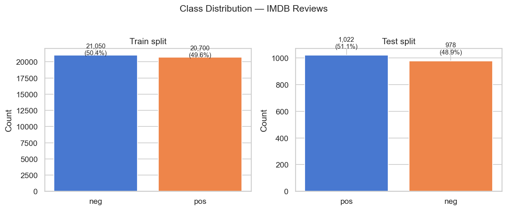

Reviews are considerably longer than other sentiment datasets: the average of 178 words per review exceeds typical tweet lengths (≈20 words) by almost an order of magnitude.

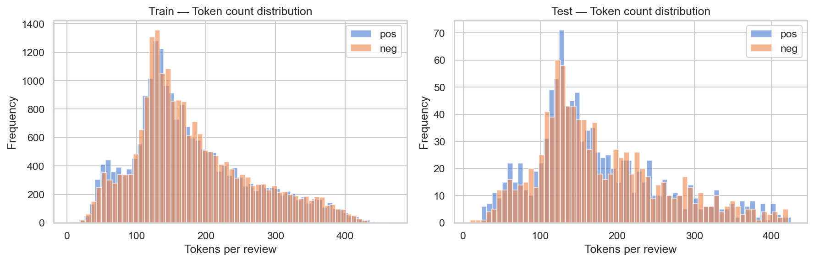

The most frequent words after stopword removal reflect typical movie review vocabulary. Word clouds for positive and negative reviews reveal the domain-specific vocabulary that lexicon tools partially miss.

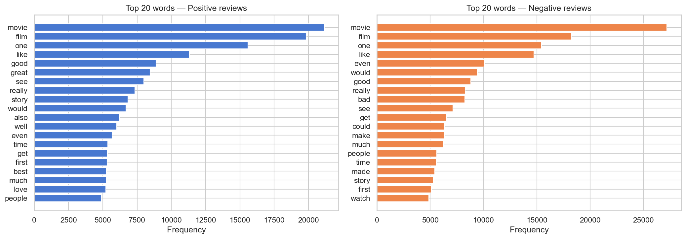

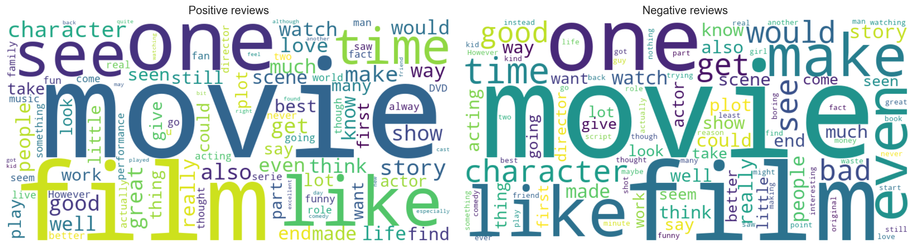

This length has direct consequences for each method:

- **Lexicon-based tools** aggregate polarity over many tokens, making them susceptible to noise from neutral words and reducing the signal-to-noise ratio.
- **Transformer models** truncate reviews longer than 512 tokens (approximately 15% of the dataset).
- **Classical ML models** benefit from the richer per-sample vocabulary, favouring large TF-IDF feature spaces.
- **LLM inference** used reviews truncated to 1 500 characters to keep API costs manageable.

---

## 3. Methodology

### 3.1 Baseline Evaluation: Off-the-shelf Sentiment Analysis Tools

As a first step, a set of pre-existing tools was applied directly to the test set without any task-specific training or parameter adjustment. These experiments serve as a reference baseline, establishing the upper bound of what off-the-shelf methods can achieve and providing a point of comparison for all subsequent approaches.

**TextBlob** computes a document-level polarity score in the range [−1, 1] by averaging word-level polarities from its built-in lexicon, derived from the Pattern library. A score greater than zero is assigned the label `pos`; zero or below is assigned `neg`. No preprocessing was applied prior to scoring, as the tool is designed to operate on raw text. TextBlob achieved an accuracy of **70.0%**, characterised by high recall (0.944) but low precision (0.640). This pronounced imbalance reflects a systematic positive-class bias: the lexicon was constructed from general-purpose web text in which positive language is overrepresented relative to a balanced benchmark, causing the tool to over-predict positive sentiment.

**VADER** (Valence Aware Dictionary and sEntiment Reasoner) is a rule-based analyser designed specifically for short social media content. It produces a compound score in [−1, 1] by combining word-level valence ratings with heuristic rules for modifiers such as capitalisation, punctuation, and degree adverbs. A compound score of 0.05 or above was mapped to `pos`; all other values to `neg`. VADER achieved **70.2% accuracy**, virtually identical to TextBlob, with similarly high recall (0.856) and low precision (0.660). Although VADER incorporates more sophisticated rules than a pure lexicon lookup, its modifier heuristics were calibrated for short texts and lose reliability when aggregated across the approximately 175 tokens of a typical IMDB review.

**Stanza** applies a full neural NLP pipeline that includes a sentence-level sentiment classifier trained on the Stanford Sentiment Treebank. For each review, the pipeline produces a three-class prediction per sentence (negative = 0, neutral = 1, positive = 2); these scores were averaged across all sentences and a threshold of greater than 1.0 was used to assign the `pos` label. Stanza achieved **83.4% accuracy**, a substantial improvement of 13 percentage points over VADER and TextBlob. The neural sentence-level model captures contextual interactions within sentences that word-list approaches cannot represent. However, Stanza exhibits the opposite precision–recall trade-off to the other tools: high precision (0.933) at the expense of recall (0.726), indicating a tendency toward conservative positive predictions.

**DistilBERT pre-trained (SST-2)** was evaluated using the Hugging Face `pipeline` API with the checkpoint `distilbert-base-uncased-finetuned-sst-2-english`, a 66-million-parameter transformer fine-tuned on SST-2 short sentence fragments. No further training on IMDB data was performed, making this a zero-shot cross-domain transfer evaluation. Reviews were truncated to 512 subword tokens to comply with the model's maximum sequence length. This approach achieved **90.0% accuracy**, the highest among all baseline methods and substantially above Stanza. The result demonstrates the breadth of language knowledge encoded in a pre-trained transformer, which generalises from short SST-2 snippets to full-length IMDB reviews without any domain adaptation.

**Baseline results summary:**

| Approach                        | Acc.   | Prec.  | Rec.   | F1     |
|---------------------------------|--------|--------|--------|--------|
| DistilBERT (pre-trained, SST-2) | 0.9000 | 0.9228 | 0.8777 | 0.8997 |
| Stanza                          | 0.8335 | 0.9333 | 0.7260 | 0.8167 |
| VADER                           | 0.7015 | 0.6604 | 0.8562 | 0.7456 |
| TextBlob                        | 0.7000 | 0.6399 | 0.9442 | 0.7628 |

Figure 5 summarises accuracy and F1 across the four baseline tools. The contrast between TextBlob/VADER and Stanza illustrates the performance ceiling of purely word-counting approaches, while DistilBERT's 90.0% accuracy establishes a strong reference point for trained models. Figure 6 shows the confidence distribution of the DistilBERT SST-2 classifier: predictions are heavily concentrated near 0 and 1, indicating that the model assigns high confidence to most reviews, with only a small proportion near the decision boundary.

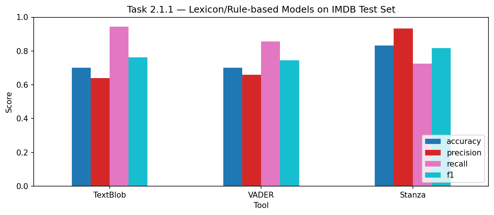

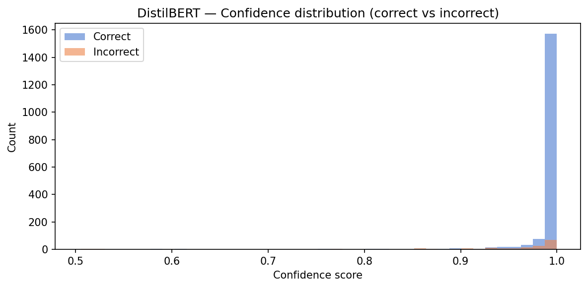

---

### 3.2 Lexicon-Based Classification with NRC EmoLex

The NRC Word-Emotion Association Lexicon (EmoLex) associates 14 182 English words with binary flags for positive and negative polarity, plus eight emotion categories (anger, anticipation, disgust, fear, joy, sadness, surprise, trust). For this task only the `Positive` and `Negative` columns were used.

**Preprocessing pipeline:** reviews were lowercased and lemmatized with NLTK's `WordNetLemmatizer` to map inflected forms (e.g. *loved* → *love*) to their dictionary entries, maximising lexicon coverage. Punctuation was kept, as it does not affect lookup.

**Classification rule:** for each review, count the total number of tokens that are flagged as `Positive` (score *P*) and the total flagged as `Negative` (score *N*). The predicted label is `pos` if *P* > *N*, and `neg` otherwise; ties default to `neg`. This rule is intentionally simple — it treats every matched token as an equally weighted vote, with no weighting by frequency or position.

**Negation handling (window = 3):** negation is processed *before* stopword removal. After any trigger word (*not, no, never, n't, nor, neither, hardly, barely, scarcely*), the polarity vote of the **next three tokens** is flipped: a token that would have added to *P* instead adds to *N*, and vice versa. For example, in *"not a good film"*, the tokens *good* and *film* are marked `_NEG`, reversing their contribution. The window size of 3 was chosen to cover short negation scopes without propagating too far across clause boundaries.

| Approach                          | Acc.   | Prec.  | Rec.   | F1     |
|-----------------------------------|--------|--------|--------|--------|
| NRC Lexicon + Negation (window=3) | 0.6550 | 0.6254 | 0.8102 | 0.7059 |
| NRC Lexicon (no negation)         | 0.6460 | 0.6160 | 0.8160 | 0.7020 |

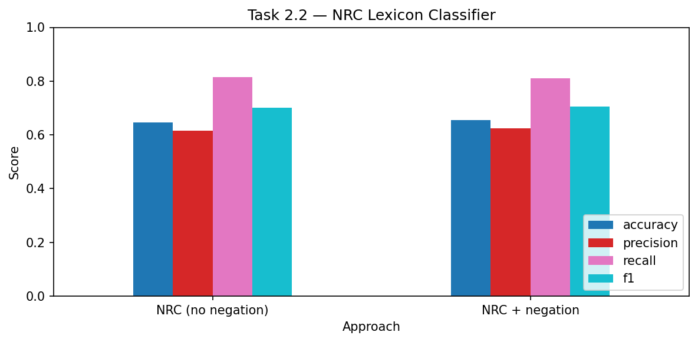

Both configurations are above the 51.1% majority baseline but are the weakest results across all tasks. The table shows a consistent positive-recall bias (≥ 0.81 in both rows): the classifier frequently predicts `pos`, likely because movie review language contains more affective positive vocabulary even in negative reviews (e.g. praising individual performances while criticising the film overall). Precision is correspondingly low (≈ 0.62–0.63), confirming that many of these positive predictions are incorrect. Negation handling yields a +0.9 pp accuracy gain and a small precision improvement (+0.9 pp), with a negligible recall change — the window heuristic corrects some false positives but cannot capture long-range or discourse-level negation. The dominant limitation is **lexicon coverage**: a large share of IMDB vocabulary (character names, film titles, genre-specific terms, colloquial expressions) has no NRC entry and contributes nothing to the polarity count, effectively discarding a large part of each review's signal.

---

### 3.3 Supervised Classification with Classical Machine Learning

Supervised classifiers were trained on the full 41 750-review training set and evaluated on the 2 000-review test set using `scikit-learn`. Rather than selecting a single configuration a priori, the experimental design systematically varied preprocessing choices, feature representations, and classifier families in order to isolate the contribution of each component and identify which combinations generalise best to unseen data.

#### Preprocessing Pipeline

Text preprocessing was implemented as a configurable pipeline in `src/utils.py`, allowing each step to be switched on or off independently. This design made it possible to isolate the contribution of each transformation. The steps applied, in order, are:

1. **Lowercasing** — maps all characters to lowercase, reducing vocabulary size and preventing *Film* and *film* from being treated as distinct features.
2. **Punctuation removal** — strips non-alphabetic tokens (periods, commas, etc.), which carry no polarity signal for bag-of-words representations.
3. **Negation marking** — before removing stopwords, scans tokens for negation trigger words (*not, no, never, n't, nor, neither, hardly, barely, scarcely*) and appends the `_NEG` suffix to the next three tokens. Applying negation before stopword removal is important: without this ordering, tokens inside the negation window that happen to be stopwords would be discarded before they could be marked. The suffix creates distinct vocabulary entries for negated contexts — `good` and `good_NEG` become separate features — so the classifier can learn that *good* and *not good* have opposite polarity.
4. **Stopword removal** — removes frequent function words (e.g. *the*, *a*, *is*) that carry no sentiment information and inflate feature dimensionality. Negation trigger words (*not*, *never*, etc.) are explicitly exempted from this step so they are never deleted.
5. **Lemmatization** — reduces inflected forms to their base (e.g. *loved* → *love*, *films* → *film*) using NLTK's `WordNetLemmatizer`, concentrating polarity evidence on fewer vocabulary entries and improving lexicon recall.

Three preprocessing configurations were compared: (i) lowercase only, (ii) lowercase + stopword removal + lemmatization, and (iii) the full pipeline including negation marking.

#### Feature Representations

Documents were represented as fixed-length numeric vectors using three schemes, all built from the training vocabulary and applied identically to the test set:

**Bag-of-Words (BoW)** counts how many times each of the top 10 000 most frequent words appears in a review. Each review becomes a sparse vector of raw counts. BoW is simple and fast but treats word order and frequency distribution equally, so common words dominate regardless of their discriminative power.

**TF-IDF unigrams** reweights the same vocabulary by multiplying term frequency (TF) by inverse document frequency (IDF). Words that appear in nearly every review (e.g. *movie*, *film*) receive low IDF weights, while words that appear frequently in only one class receive high weights. This suppresses noise and amplifies discriminative signal.

**TF-IDF bigrams** extends the above to include consecutive word pairs (bigrams) alongside single words. Bigrams capture short collocations with a different meaning than their parts — *not bad*, *highly recommended*, *worst ever* — which pure unigram models miss entirely. The vocabulary is again capped at the top 10 000 features.

#### Classifiers

Three classifier families were evaluated, each representing a different modelling philosophy:

**Logistic Regression (LR)** learns a linear decision boundary in the feature space by optimising log-likelihood with L2 regularisation. It produces well-calibrated probability outputs and is one of the strongest linear baselines for text classification. The regularisation strength C was searched over {0.1, 1, 10}.

**Multinomial Naive Bayes (NB)** assumes that feature counts are conditionally independent given the class. Despite this unrealistic assumption, NB is computationally efficient and often surprisingly competitive on short texts. However, its independence assumption is more heavily violated in long reviews where word co-occurrence patterns are meaningful. The Laplace smoothing parameter α was searched over {0.1, 1.0}.

**Linear SVM** finds the maximum-margin hyperplane separating the two classes. Unlike LR, the SVM loss (hinge) only cares about the support vectors — examples closest to the decision boundary — making it robust to the large number of uninformative features typical in high-dimensional text. The regularisation parameter C was searched over {0.1, 1, 10}.

All hyperparameters were selected via 5-fold cross-validation on the training set. The test set was held out entirely until final evaluation.

| Model              | Features                         | Acc.   | Prec.  | Rec.   | F1     |
|--------------------|----------------------------------|--------|--------|--------|--------|
| SVM (C=0.1) ★      | TF-IDF bigrams + negation        | 0.9025 | 0.9034 | 0.9061 | 0.9047 |
| SVM (C=1)          | TF-IDF bigrams + negation        | 0.9010 | 0.9112 | 0.8933 | 0.9022 |
| LR (C=1)           | TF-IDF bigrams                   | 0.9000 | 0.9014 | 0.9031 | 0.9022 |
| SVM (C=1)          | TF-IDF unigrams                  | 0.9000 | 0.9014 | 0.9031 | 0.9022 |
| LR (C=1)           | TF-IDF unigrams                  | 0.8925 | 0.8929 | 0.8973 | 0.8951 |
| LR (C=1)           | BoW + stopwords + lemma          | 0.8825 | 0.8885 | 0.8806 | 0.8845 |
| LR (C=1)           | BoW (lowercase only)             | 0.8815 | 0.8875 | 0.8796 | 0.8835 |
| NB (α=1)           | BoW + stopwords + lemma          | 0.8580 | 0.8758 | 0.8415 | 0.8583 |
| SVM (C=1)          | BoW + stopwords + lemma          | 0.8540 | 0.8614 | 0.8513 | 0.8563 |

★ Best model selected by GridSearchCV (5-fold CV on training set, C ∈ {0.1, 0.5, 1, 5, 10}).

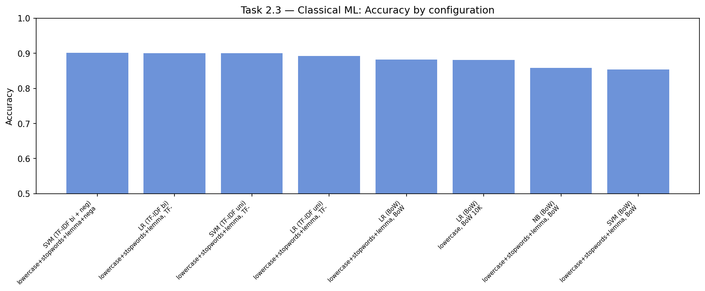

Figure 8 presents the accuracy of all evaluated configurations, grouped by feature representation and classifier. Three consistent patterns emerge from the results.

The choice of **feature representation is the dominant factor**, exerting a stronger influence on accuracy than the choice of classifier. Moving from BoW to TF-IDF unigrams yields roughly +1 pp for Logistic Regression, and adding bigrams to TF-IDF gains a further +0.8 pp — a total shift of nearly 2 pp just from changing how text is encoded, while keeping the classifier fixed. This confirms that for long-form text like IMDB reviews, the quality of the feature representation is a stronger bottleneck than the choice of learning algorithm.

Second, **negation marking provides a consistent improvement** on top of the best TF-IDF configuration. The SVM with TF-IDF bigrams and negation reaches 90.25% accuracy after cross-validated hyperparameter tuning, compared to 90.0% for the same model without negation. Although the gain is modest (+0.25 pp), it is consistent across multiple configurations and confirms that explicitly encoding negation at the feature level — rather than relying on bigrams alone — captures information that a purely data-driven bigram vocabulary does not. A phrase like *not good* appears as the bigram *not_good* and also as the unigram *good_NEG*, giving the model two complementary signals for the same construct.

Third, **Naive Bayes is the weakest of the three classifiers** across all feature representations. Its 85.8% accuracy with BoW is 3 pp below LR on the same features. The most likely explanation is the conditional independence assumption: in IMDB reviews, the presence of *great* is correlated with the presence of *acting* and *performance*, and NB cannot model these co-occurrence patterns. SVM and LR, both discriminative models, learn directly from the boundary between classes and are not penalised by this assumption.

The cross-validated GridSearchCV found C = 0.1 as the optimal regularisation for the best SVM configuration (CV accuracy 90.23%), effectively tied with C = 1. The insensitivity to regularisation strength suggests that, at 10 000 TF-IDF features, the model is not overfitting and the data is sufficiently separable that tighter margins do not help.

---

### 3.4 Domain Adaptation via Transformer Fine-tuning

While the pre-trained DistilBERT checkpoint from Task 2.1.2 provides a strong zero-shot baseline, it was trained on the Stanford Sentiment Treebank (SST-2), which consists of short movie snippet phrases rather than full reviews. Task 2.3 explored whether fine-tuning this model directly on IMDB data — adapting its weights to the longer review format and the specific vocabulary of the dataset — could yield a measurable improvement.

The model `distilbert-base-uncased` was fine-tuned on the full 41 750-review training set using the Hugging Face `Trainer` API. Reviews were tokenised and truncated to a maximum of 512 subword tokens, which covers the majority of reviews (approximately 85% fit within this limit). Dynamic padding was applied per batch using `DataCollatorWithPadding`, so each batch is padded only to the length of its longest example rather than always to 512 — this significantly reduces computation on short batches.

Training was performed on CPU (Apple MPS was disabled due to out-of-memory errors on the full dataset). The configuration below was chosen to balance training stability, convergence speed, and available hardware:

| Parameter         | Value                     |
|-------------------|---------------------------|
| Epochs            | 3                         |
| Learning rate     | 2 × 10⁻⁵                 |
| Batch size        | 16                        |
| Weight decay      | 0.01                      |
| Early stopping    | patience = 1 (val. acc.)  |
| Seed              | 42                        |
| Hardware          | CPU (MPS disabled — OOM)  |
| Training loss     | 0.146                     |
| Runtime           | ≈ 6.5 hours               |

A validation set (10% of training data) was used for early stopping: training halted if validation accuracy did not improve for one full epoch. The best checkpoint was reloaded for final evaluation on the test set.

| Model                                  | Acc.    | Prec.   | Rec.    | F1      |
|----------------------------------------|---------|---------|---------|---------|
| DistilBERT fine-tuned (3 epochs, IMDB) | 0.9475  | 0.9508  | 0.9462  | 0.9485  |
| DistilBERT pre-trained (SST-2)         | 0.9000  | 0.9228  | 0.8777  | 0.8997  |
| **Gain**                               | +0.0475 | +0.0280 | +0.0685 | +0.0488 |

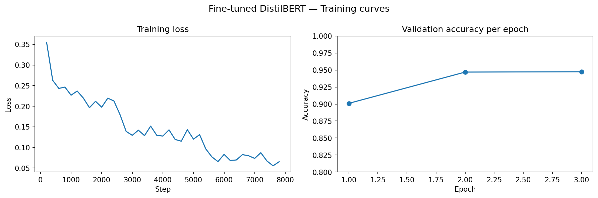

The results in the table show a clear and consistent improvement across all four metrics after fine-tuning. Accuracy increases by 4.75 pp (90.0% → 94.75%), and F1 improves by 4.88 pp. The most pronounced gain is in **recall (+6.85 pp)**, which reveals an important characteristic of the SST-2 checkpoint: when applied to IMDB reviews without fine-tuning, it is overly conservative about predicting the positive class. This makes sense given the domain mismatch — SST-2 contains short sentence fragments where positive sentiment is often expressed through single strong adjectives (*great*, *excellent*), whereas full IMDB reviews mix positive and negative observations across many sentences before arriving at an overall positive conclusion. Fine-tuning on IMDB data teaches the model to integrate this longer-range structure, correcting the positive-class undercount and bringing precision (−2 pp) and recall (+6.85 pp) into much closer balance.

Figure 9 shows the training loss decreasing steadily across epochs while validation accuracy improves, with no sign of overfitting over 3 epochs. This suggests that with more compute, additional epochs or a larger batch size could still yield further gains.

The approximately 6.5-hour CPU training time is the main practical limitation of this approach. The same configuration on a modern GPU (e.g., Google Colab T4) typically completes in under 30 minutes, making it a viable option for iterative experimentation.

---

### 3.5 Zero-Shot and Few-Shot Prompting with Large Language Models

The final set of experiments investigated whether instruction-following large language models (LLMs) can perform binary sentiment classification without any adaptation to the target dataset. Unlike all preceding approaches, no model parameters are modified: the classifier is defined entirely by the natural-language prompt supplied at inference time, and the LLM's pre-trained knowledge is the sole source of task-relevant information.

Due to API cost constraints, this task was evaluated on a **stratified 500-sample subset** of the test set (250 positive and 250 negative reviews, drawn at random with seed 42), rather than the full 2 000-review set used in all other tasks.

**Model:** `claude-haiku-4-5-20251001` (Anthropic API), a fast and cost-efficient instruction-following model. Each review was truncated to 1 500 characters before being inserted into the prompt, and responses were limited to `max_tokens=10`. Zero API errors were encountered across all 1 500 calls (500 reviews × 3 prompts).

**Response parsing:** the model was instructed to reply with a single word. The label was extracted by searching the response for the first occurrence of *positive* or *negative* (case-insensitive regex). This parsing strategy was robust — in practice, the model almost always responded with exactly one of the two target words.

Three prompt strategies were tested, each designed to provide a different level of context. The full prompt texts are included in Appendix A.

**Prompt 1 — Generic:** a minimal instruction asking the model to classify the sentiment of the text as *positive* or *negative*, with no information about the domain, the task, or examples. This establishes the floor for instruction-based performance using only the model's general language understanding.

**Prompt 2 — Domain-aware:** extends the generic prompt by specifying that the text is a movie review and that the model is acting as a movie review analyst. This anchors the classification to the correct domain, helping the model disambiguate cases where general-purpose sentiment cues conflict with movie-review conventions (e.g. a review that praises performances but criticises the plot overall).

**Prompt 3 — Few-shot:** provides six labelled examples before the target review — three positive and three negative, each truncated to 300 characters and drawn from the training set (seed 42). The intent is to show the model the label format and the type of language typical of each class, potentially shifting its decision boundary toward the specific style of IMDB reviews.

| Prompt strategy | Acc.       | Prec.  | Rec.       | F1         |
|-----------------|------------|--------|------------|------------|
| Few-shot        | **0.9620** | 0.9529 | **0.9720** | **0.9624** |
| Domain-aware    | 0.9600     | 0.9637 | 0.9560     | 0.9598     |
| Generic         | 0.9580     | 0.9751 | 0.9400     | 0.9572     |

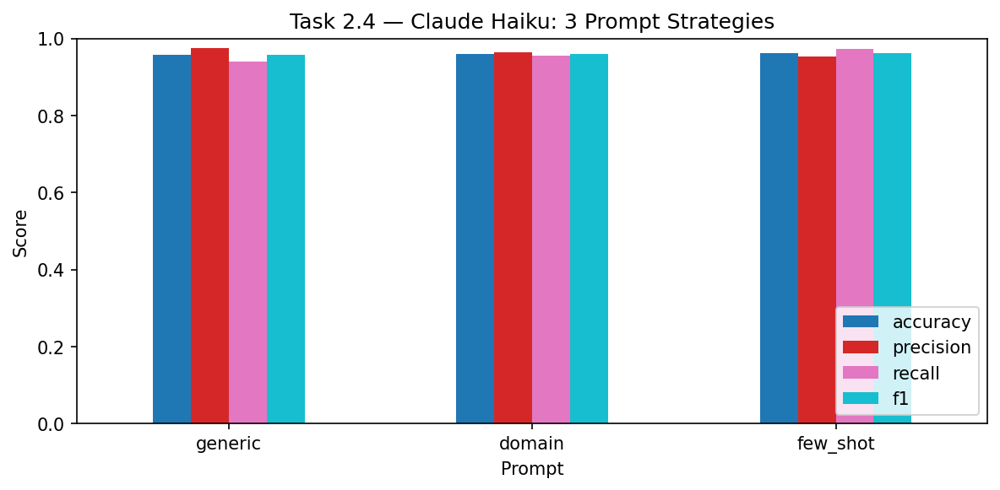

All three strategies achieve ≥ 95.8% accuracy on the 500-sample subset, demonstrating that instruction-following LLMs are highly capable sentiment classifiers even without any task-specific training. Figure 10 shows the four metrics side by side across prompt strategies; the differences between prompts are small but consistent.

The few-shot prompt achieves the best overall performance (96.2% accuracy, F1 = 0.9624), driven primarily by the highest recall (97.2%). Providing labelled examples appears to make the model more willing to predict the positive class, which reduces false negatives at a small cost to precision (95.3%, the lowest of the three). The domain-aware prompt comes second (96.0% accuracy, F1 = 0.9598), with the highest precision (96.4%) and well-balanced recall (95.6%). The generic prompt, despite having the least context, is only 0.4 pp behind in accuracy (95.8%) and achieves the highest precision of all (97.5%), meaning it makes fewer false positive predictions — though at the cost of lower recall (94.0%).

The ordering of strategies — few-shot > domain > generic — is consistent with the intuition that more context helps: examples provide the strongest signal, domain framing provides moderate signal, and bare instructions provide the least. However, the performance gap between them is narrow (less than 0.5 pp in accuracy), which suggests that Claude Haiku already has a strong internal representation of movie review sentiment from pre-training, and that additional context refines rather than transforms its predictions.

**Important caveat:** these results are based on a 500-sample stratified subset rather than the full 2 000-review test set used in all other tasks. While the subset is balanced and randomly sampled, results at this scale carry more statistical uncertainty and should not be directly compared with other task results without this in mind.

---

## 4. Results and Discussion

Table 1 consolidates the best result from each experimental family, ordered by accuracy. For the supervised learning experiments, both the best classical ML configuration and the fine-tuned transformer are reported separately, as they represent qualitatively distinct approaches within the same task.

**Table 1 — Best result per experimental family, ordered by accuracy.**

| Task  | Best approach                       | Acc.       | Prec.  | Rec.   | F1     |
|-------|-------------------------------------|------------|--------|--------|--------|
| 2.4   | Claude Haiku — few-shot prompt †    | **0.9620** | 0.9529 | 0.9720 | 0.9624 |
| 2.3   | DistilBERT (fine-tuned, 3 epochs)   | 0.9475     | 0.9508 | 0.9462 | 0.9485 |
| 2.3   | SVM — TF-IDF bigrams + negation     | 0.9025     | 0.9034 | 0.9061 | 0.9047 |
| 2.1.2 | DistilBERT (pre-trained, SST-2)     | 0.9000     | 0.9228 | 0.8777 | 0.8997 |
| 2.1.1 | Stanza                              | 0.8335     | 0.9333 | 0.7260 | 0.8167 |
| 2.1.1 | VADER                               | 0.7015     | 0.6604 | 0.8562 | 0.7456 |
| 2.1.1 | TextBlob                            | 0.7000     | 0.6399 | 0.9442 | 0.7628 |
| 2.2   | NRC Lexicon + Negation              | 0.6550     | 0.6254 | 0.8102 | 0.7059 |

† Evaluated on a stratified 500-sample subset of the test set (250 pos + 250 neg).

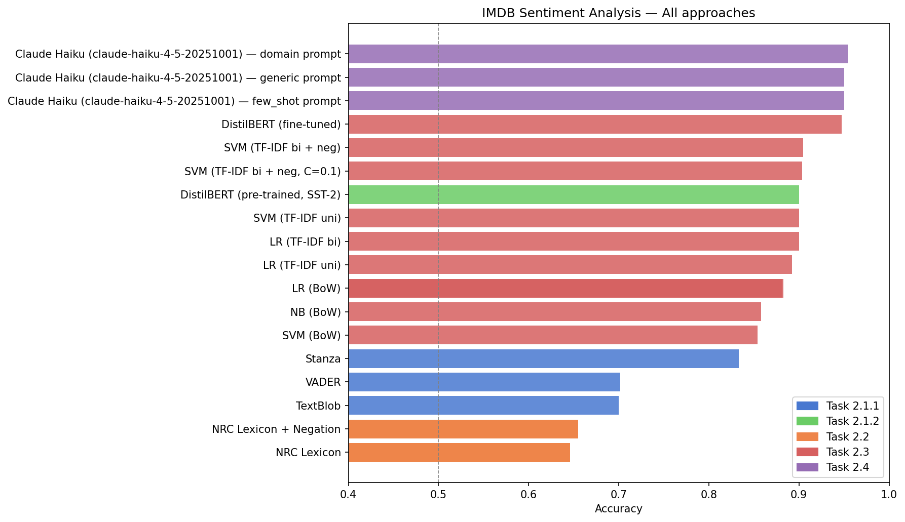

Figure 11 ranks all approaches by accuracy, colour-coded by experimental family. The results span a range of approximately 31 percentage points — from 65.5% for the NRC lexicon classifier to 96.2% for Claude Haiku with few-shot prompting — and the ordering broadly reflects the degree to which each approach can model contextual and compositional aspects of sentiment.

Three performance tiers can be identified. The lowest tier comprises the purely lexical approaches: the NRC EmoLex classifier (65.5%) and the rule-based tools TextBlob and VADER (≈70%). All three assign polarity based on individual token lookups without modelling how words interact in context. Given that IMDB reviews average approximately 175 words and routinely mix negative observations with an overall positive assessment (or vice versa), word-level aggregation is an insufficient summary of document-level sentiment. Stanza (83.4%) occupies an intermediate position, outperforming the other off-the-shelf tools by 13 percentage points by operating at the sentence level rather than the word level — a result that underscores the importance of even minimal contextual modelling.

The middle tier groups the pre-trained DistilBERT SST-2 baseline (90.0%) with the strongest classical ML configurations (85.4%–90.25%). Notably, the best classical approach — an SVM with TF-IDF bigrams and negation marking — achieves 90.25%, effectively matching a pre-trained transformer in accuracy while requiring no GPU and completing training in under two minutes on CPU. This convergence suggests that, for binary sentiment classification on a well-balanced dataset with sufficiently rich features, discriminative linear models over sparse TF-IDF representations approach the same decision boundary as contextualised neural encoders.

The top tier is formed by the two approaches that most effectively leverage large-scale pre-training: fine-tuned DistilBERT (94.75%) and Claude Haiku with few-shot prompting (96.2%). Fine-tuning adds 4.75 percentage points over the zero-shot baseline by adapting the model weights to the IMDB domain, with the largest gain in recall. Claude Haiku achieves the highest accuracy without any weight updates, relying entirely on the knowledge accumulated during pre-training and the task specification encoded in the prompt. The 1.45 pp gap between these two systems (96.2% vs 94.75%) should be interpreted cautiously, as the LLM results are based on a 500-sample subset rather than the full test set used for all other approaches. A statistically definitive comparison would require evaluation on the complete 2 000-review test set.

---

## 5. Conclusions

This work carried out a systematic comparison of sentiment analysis approaches across four paradigms — lexicon-based tools, a custom NRC classifier, classical machine learning, and instruction-based LLMs — applied to the IMDB Movie Reviews dataset. The experiments span a wide range of complexity and resource requirements, from rule-based word-list lookups to a 66-million-parameter fine-tuned transformer, and together paint a clear picture of how each family of methods scales with linguistic sophistication.

The weakest results come from approaches that treat sentiment as a bag of individually scored words. The NRC EmoLex classifier (64.6–65.5%) suffers from limited vocabulary coverage: a large fraction of movie review vocabulary — character names, genre jargon, colloquialisms — has no lexicon entry, leaving most tokens unscored. Negation handling improves accuracy by 0.9 pp, a consistent but modest effect; the window-based heuristic captures short negation scopes but is insufficient for the complex, multi-clause structures common in IMDB reviews. TextBlob and VADER (≈70%) reach higher accuracy through richer rule sets but still aggregate polarity at the word level, making them susceptible to noise in long texts.

Stanza's neural sentence-level model (83.4%) shows that even a moderate amount of contextual modelling dramatically outperforms pure word-counting. The 13 pp gap between VADER and Stanza on the same data is striking given that both are nominally "off-the-shelf" tools — the key difference is that Stanza models sentence structure rather than word polarity in isolation.

Classical ML with TF-IDF bigrams and negation marking reaches 90.25%, matching the pre-trained DistilBERT SST-2 baseline (90.0%) despite being far simpler and faster to train. This is perhaps the most practically relevant finding: for deployments where inference cost, latency, or interpretability matter, a well-tuned SVM over TF-IDF features remains highly competitive with transformer models that are orders of magnitude larger.

Fine-tuning DistilBERT on the IMDB training set (94.75%) closes the domain gap between SST-2 and full-length movie reviews, with the most pronounced gain in recall (+6.85 pp). This confirms that the SST-2 checkpoint underpredicts the positive class on long reviews, and that 3 epochs of domain-specific training is sufficient to correct this bias.

Instruction-tuned Claude Haiku achieves the highest accuracy in this study (96.2% with few-shot prompting, evaluated on 500 samples). All three prompt strategies exceed 95.8%, demonstrating that large generative models can perform high-quality sentiment classification through instruction following alone, without any adaptation to the target dataset. The few-shot prompt outperforms the domain-aware and generic variants, suggesting that labelled examples further refine the model's calibration even when its general knowledge of the domain is already strong.

### Future Work

The main limitations of this study point directly to avenues for improvement. The LLM evaluation on 500 samples introduces statistical uncertainty; evaluating on the full 2 000-review test set would allow a direct and reliable comparison with all other methods. On the classical ML side, adding POS-tag filtering or character n-grams could further improve the TF-IDF pipeline. For the NRC classifier, combining EmoLex with a second lexicon such as SentiWordNet or AFINN would improve vocabulary coverage and reduce the fraction of reviews where the polarity count is tied. Finally, fine-tuning on GPU would make hyperparameter search over learning rate, batch size, and number of epochs practical, and would enable experimentation with larger transformer variants such as RoBERTa or BERT-large.

---

## Appendix A — Prompt Definitions

The following prompts were used verbatim in the Claude Haiku experiments (Task 2.4). Review text was truncated to 1 500 characters before insertion. All calls used `max_tokens=10` and default temperature.

### Prompt 1 — Generic

```
Classify the sentiment of the following text as "positive" or "negative".
Reply with only one word.

Text: {review}
```

### Prompt 2 — Domain-aware

```
You are analyzing movie reviews. Classify the sentiment of the following
movie review as "positive" or "negative".
Reply with only one word.

Review: {review}
```

### Prompt 3 — Few-shot

```
Classify movie review sentiment as "positive" or "negative".

Examples:
[POS] {example_pos_1}
[NEG] {example_neg_1}
[POS] {example_pos_2}
[NEG] {example_neg_2}
[POS] {example_pos_3}
[NEG] {example_neg_3}

Now classify:
{review}

Reply with only one word: positive or negative.
```

The six few-shot examples were sampled from the training set (random seed 42): 3 positive and 3 negative reviews, each truncated to 300 characters within the prompt.
